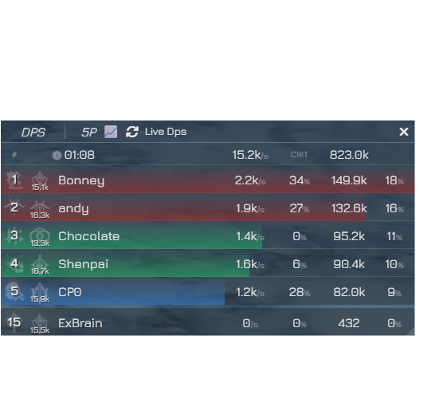
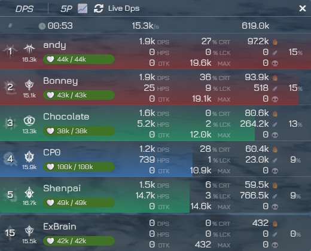

# BPSR Meter

BPSR Meter is a desktop application that acts as a real-time DPS (Damage Per Second) meter for the game. It overlays the game window to provide detailed combat statistics without interrupting your gameplay.

## Application

This repository is a copy of [BPSR-Meter](https://github.com/mrsnakke/BPSR-Meter) with some UI adjustments.

## Responsible Use

This tool is designed to help you improve your own performance. **Please do not use it to degrade, harass, or discriminate against other players.** The goal is self-improvement and enjoying the game as a community.

## Compile

Run `npm run dist` to compile the project

## Installation

1. **Install Npcap:** The application requires Npcap to capture the game's network traffic. If you don't have it installed, go to the "Releases" section of this GitHub repository and download the latest version of the installer (`npcap-1.83.exe`).
2. **Download the installer:** Go to the "Releases" section of this GitHub repository and download the latest version of the installer (`BPSR Meter Setup X.X.X.exe`).
3. **Run the installer:** Execute the downloaded `.exe` file and follow the instructions to install the application on your computer.

## Usage

Once installed, you can launch the application from the Start Menu or the desktop shortcut.

The application will open as an overlay window. When you start the game, it will automatically begin detecting traffic and displaying combat stats.

If you set your uid by argument `--uid=xxxxxx` your stats will always be displayed.
